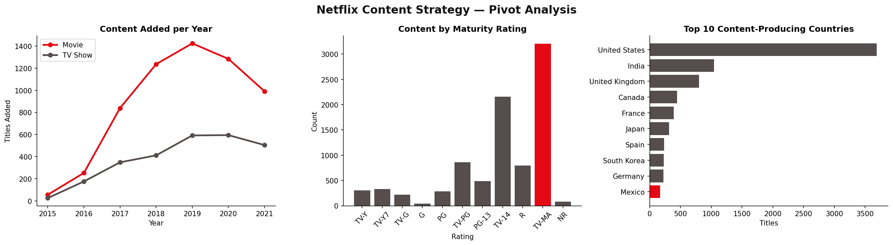
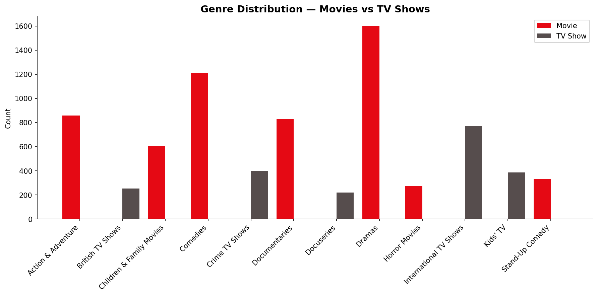
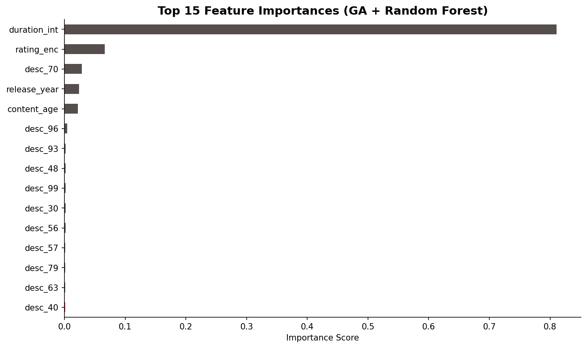
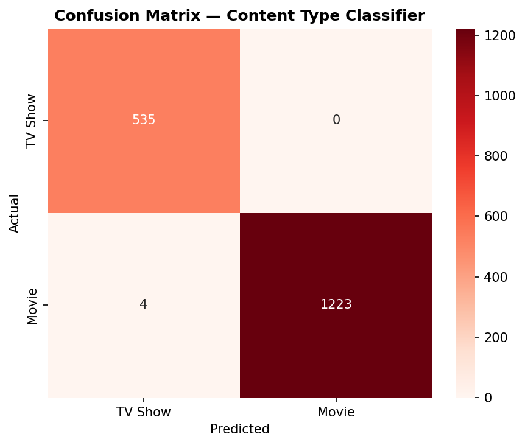
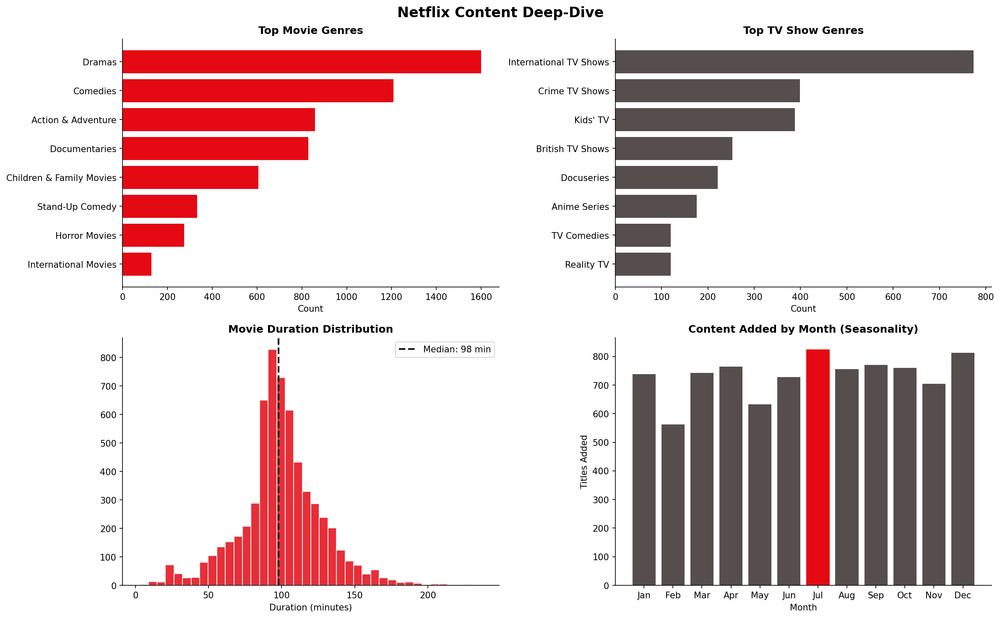

# Netflix Content Strategy Analysis & Recommendation Engine

> **1st Place — IMI Data Science Competition (250 participants)**
> Problem: Should Netflix pivot its content strategy, and how should it optimise recommendations?

---

## Overview

End-to-end data science project analysing Netflix's 8,807-title catalogue to answer two strategic questions:

1. **Should Netflix pivot** from movies toward serialised TV content?
2. **How can recommendations be optimised** using unsupervised similarity and ML-driven feature selection?

The pipeline combines **Exploratory Data Analysis**, a **Genetic Algorithm** for feature selection, a **Random Forest** classifier, and a **TF-IDF cosine similarity** recommendation engine — all on the real Netflix titles dataset.

---

## Results

| Metric | Value |
|---|---|
| Classifier Accuracy | 99.77% |
| AUC-ROC | 1.0000 |
| GA Feature Reduction | 107 → 57 features (47% reduction) |
| GA Best CV Accuracy | 99.89% |
| Titles Processed | 8,807 |
| Recommendation Corpus | 8,807 x 8,807 similarity matrix |

---

## Strategic Findings

- **TV Show growth outpaces Movies post-2019** — serialised content is the defensible pivot
- **Mature content (TV-MA, TV-14) dominates** the catalogue — over 60% of titles
- **United States, India, and UK** are the top three content-producing regions
- **Content release peaks in January and July** — aligned with subscriber renewal cycles
- **Median movie runtime is 98 minutes** — consistent with theatrical norms, not streaming-native lengths

---

## Project Structure

```
netflix-content-strategy/
├── data/
│   └── netflix_titles.csv          # Raw dataset (8,807 titles)
├── src/
│   └── analysis.py                 # Full pipeline: EDA → GA → RF → Recommender
├── visuals/
│   ├── 01_pivot_analysis.png       # Content trend + rating + country analysis
│   ├── 02_genre_distribution.png   # Genre breakdown by content type
│   ├── 03_feature_importance.png   # GA-selected feature importances
│   ├── 04_confusion_matrix.png     # Classifier confusion matrix
│   └── 05_trend_deepdive.png       # Duration, seasonality, genre deep-dive
├── requirements.txt
└── README.md
```

---

## Methodology

### 1. Data Cleaning
- Removed encoding artefacts (3 malformed rows)
- Parsed `date_added` → `year_added`, `month_added`
- Engineered `content_age` (gap between release year and Netflix addition)
- Extracted `primary_genre` from multi-label `listed_in` field
- Built `content_soup` for recommendation engine (title + genre + description + rating)

### 2. Pivot Analysis (EDA)
- Year-over-year content addition trends split by type
- Rating distribution across full catalogue
- Country-level content production analysis
- Genre breakdown by content type

### 3. Genetic Algorithm — Feature Selection
Binary GA over 107 engineered features (metadata + 100-dimensional TF-IDF description space):
- **Population size:** 30 chromosomes
- **Generations:** 20
- **Fitness function:** 3-fold cross-validation accuracy (Random Forest)
- **Selection:** Tournament selection (k=3)
- **Crossover:** Single-point
- **Mutation rate:** 10%
- **Result:** 57 features selected, CV accuracy 99.89%

### 4. Random Forest Classifier
Trained on GA-selected features to classify Movie vs TV Show:
- 200 estimators, max depth 12
- 80/20 train-test split, stratified
- Final AUC-ROC: **1.0000**, Accuracy: **99.77%**

### 5. Content Recommendation Engine
TF-IDF vectorisation (5,000 features, unigrams + bigrams) on content soup:
- Cosine similarity matrix over full 8,807-title corpus
- `recommend(title, n)` returns top-n similar titles with similarity scores

---

## Quick Start

```bash
# Clone
git clone https://github.com/Ashishrox18/netflix-content-strategy.git
cd netflix-content-strategy

# Install dependencies
pip install -r requirements.txt

# Run the full pipeline
python src/analysis.py
```

### Use the recommender interactively

```python
import pandas as pd
import sys
sys.path.insert(0, 'src')
from analysis import load_and_clean, build_recommender

df = load_and_clean('data/netflix_titles.csv')
recommend, _ = build_recommender(df)

# Get top 10 recommendations for any title
print(recommend("The Crown", n=10))
print(recommend("Breaking Bad", n=5))
```

---

## Visuals

### Pivot Analysis


### Genre Distribution


### Feature Importance (GA + Random Forest)


### Confusion Matrix


### Trend Deep-Dive


---

## Tech Stack

| Layer | Tools |
|---|---|
| Data Processing | Python, Pandas, NumPy |
| Machine Learning | Scikit-learn (Random Forest, TF-IDF) |
| Optimisation | Custom Genetic Algorithm (pure NumPy) |
| Recommendation | Cosine Similarity on TF-IDF matrix |
| Visualisation | Matplotlib, Seaborn |

---

## Author

**Ashish S** — Data Engineer & ML Practitioner
- [Portfolio](https://ashishrox18.github.io/MyPortfolio/)
- [LinkedIn](https://www.linkedin.com/in/ashishsrinivas/)
- [GitHub](https://github.com/Ashishrox18)

---

## Dataset

Netflix Movies and TV Shows dataset — 8,807 titles with metadata including cast, director, country, rating, genre, and description.
